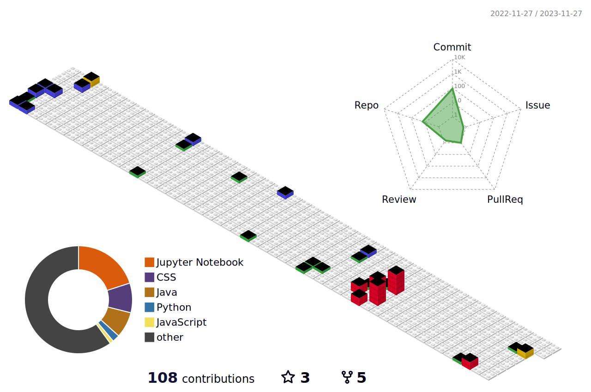

****

## :bowtie:Profile

B. Sc in Computer Engineering, Mar 2020 to Feb 2024

 

## 🛠️Tech Stack🛠️
🔈Tech that I've used at least once

       

      

   

  

## :sparkles: Research Interest

- Data Science and Analytics
- Recommendation system
- HCI
  
 
## :pencil2: Study log

    

#

 

<!--
**Yugyeong-Ji/Yugyeong-Ji** is a ✨ _special_ ✨ repository because its `README.md` (this file) appears on your GitHub profile.

Here are some ideas to get you started:

- 🔭 I’m currently working on ...
- 🌱 I’m currently learning ...
- 👯 I’m looking to collaborate on ...
- 🤔 I’m looking for help with ...
- 💬 Ask me about ...
- 📫 How to reach me: ...
- 😄 Pronouns: ...
- ⚡ Fun fact: ...
-->
